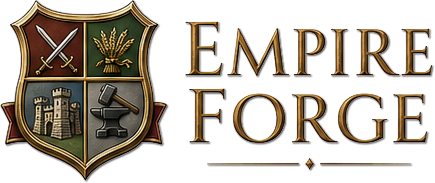
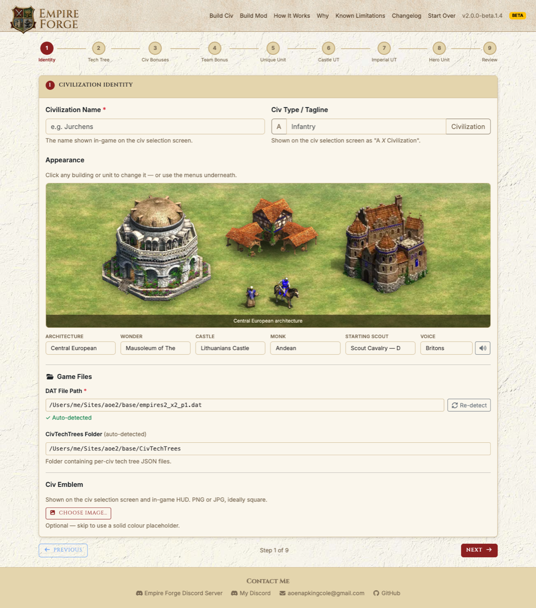
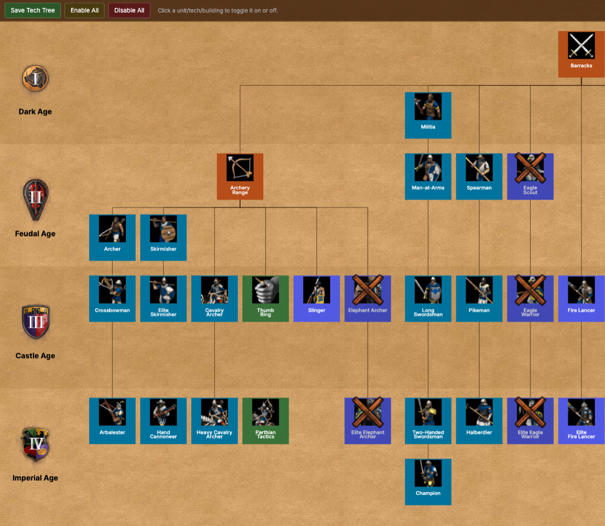
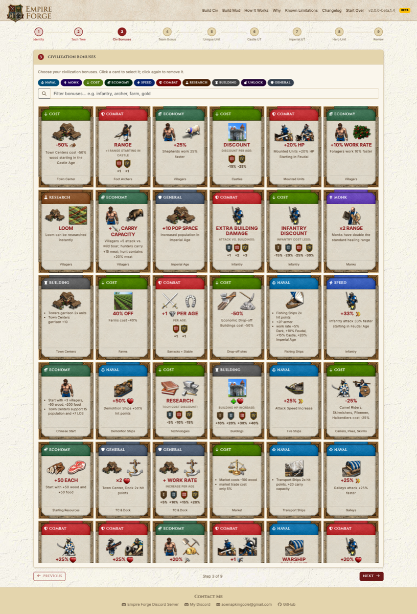
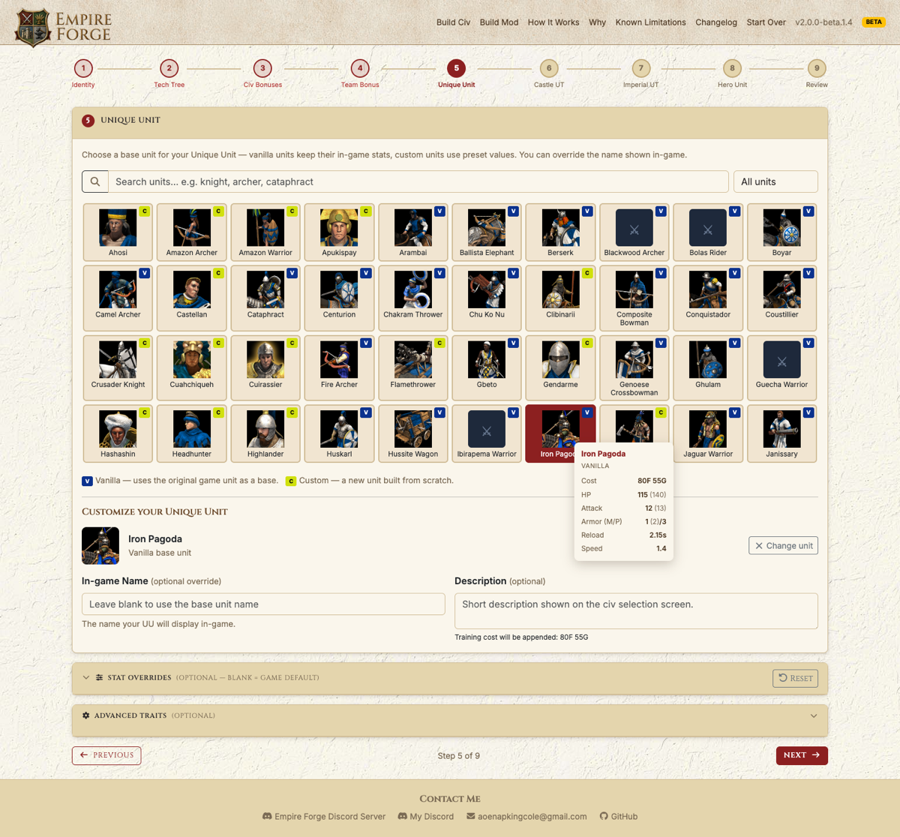
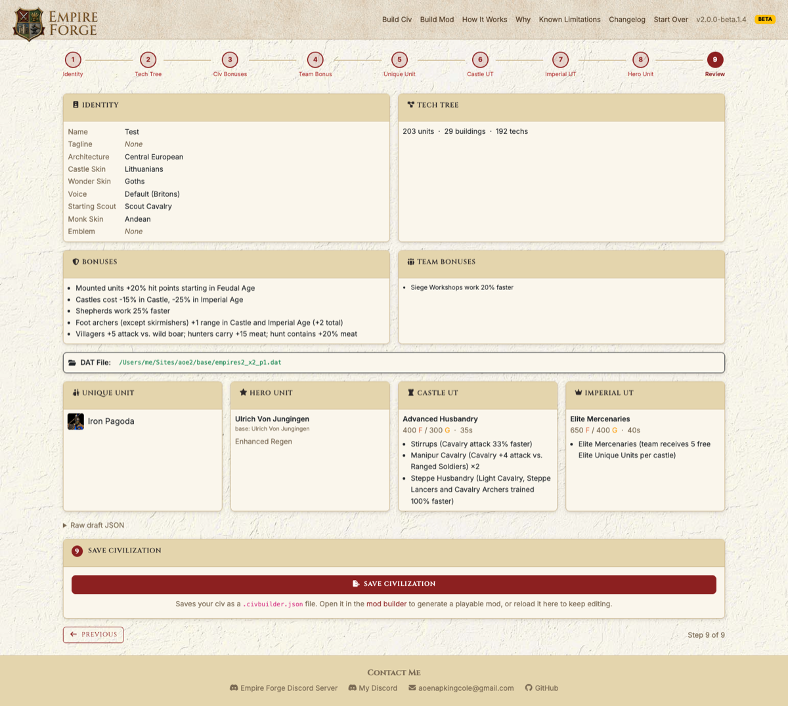

# A Civilization Builder for Age of Empires II: Definitive Edition

**Design custom civilizations for Age of Empires II: Definitive Edition and generate playable mods — no modding experience required!**

Empire Forge is a standalone civ builder. Name a civilization, pick its architecture, spoken language, build out its tech tree, choose bonuses, design a unique unit and unique technologies — then combine it with other civs into a ready-to-install AoE2:DE mod.

It runs entirely on your own computer: launching it starts a small local server and opens your browser, and every build reads your actual installed game files fresh, rather than making assumptions about the game's data file that break the moment a new DLC is released.

> **Heads up:** Most bonuses and tech tree configurations are fully supported; a small number of exotic effects aren't implemented yet and are skipped rather than failing the build — see the in-app Known Limitations page for the current list. Found a bug? Report it on [Discord](https://discord.gg/cQ5x7bfxDB) or [GitHub Issues](https://github.com/napkingcole/aoe2-empire-forge/issues).

## Screenshots

**Identity & Appearance** — name your civ, set its tagline, and pick architecture, castle, wonder, monk skin, and spoken language by clicking straight on the preview.

**Tech Tree** — Just like the in-game tech tree (Credit to [Siege Engineers](https://siegeengineers.org/) for the tech tree). Click any unit, building, or technology to enable or disable it for your civ.

**Civilization Bonuses** — browse and filter the full bonus catalog by category, click a card to select it.

**Unique Unit** — choose a vanilla or custom base unit, see its live stats, and override name, cost, or stats.

**Review & Save** — a full summary of the civ before saving it out as a `.civbuilder.json`.

## Download

Grab the latest release from the [Releases page](https://github.com/napkingcole/aoe2-empire-forge/releases). Download the `.exe` (Windows) — no coding libraries or tools required.

## How it works

1. **Build a Civ.** Step through the wizard — Identity, Bonuses, Team Bonus, Tech Tree, Unique Unit, Castle UT, Imperial UT, Heroes, Review — or use **Convert KM Civ** to bring in an existing [KrakenMeister](https://krakenmeister.com/civbuilder) civ JSON and keep editing it from there. Save your civ as a `.civbuilder.json` file.
2. **Build a Mod.** Upload one or more saved civ files, point at your `empires2_x2_p1.dat` (auto-detected), assign each civ to the vanilla civ slot it should replace, and build. You get a `.zip` with two mod folders (`-data` and `-ui`) in a few seconds.
3. **Install.** Unzip both into your AoE2:DE `mods/local/` folder, make sure the UI mod is enabled in the in-game mod manager, and select your mod as the data mod when starting a skirmish. Both mods must be active together, or your civs will play correctly but show vanilla names and icons.

The in-app **How It Works** and **Known Limitations** pages have the full walkthrough and the current list of unsupported bonus effects.

## Requirements

- Age of Empires II: Definitive Edition installed (Steam or Microsoft Store) — Empire Forge finds your game data automatically.
- That's it. No Python, no manual file editing, no third-party service.

## Why build this instead of using KrakenMeister's?

Short version: KrakenMeister's builder became stale once more and more DLCs were added, and stopped working altogether. Hardcoded assumptions about which slots in the game's data file were free, based on a snapshot of the game from when it was written, slowly became untrue. New DLCs keep adding units into those same "free" slots, corrupting existing mods. Empire Forge reads your actual installed dat file every time it builds and verifies slots and string IDs are really free before using them — so it keeps working as the game updates. The in-app **Why** page has the full story.

## Questions / feedback

- Email: [aoenapkingcole@gmail.com](mailto:aoenapkingcole@gmail.com)
- Discord Server: [server](https://discord.gg/cQ5x7bfxDB)
- Discord: `napkingcole84` ([profile](https://discord.com/users/napkingcole84))

## License

Empire Forge is licensed under the [GNU General Public License v3.0](LICENSE). You're free to use, study, modify, and share it — but any distributed copy or modified version must stay open source under the same license and keep the original attribution intact.
